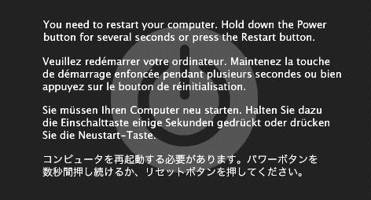

!SLIDE shout 
# ShowOffer #

!SLIDE
# おしながき #

* ShowOffer でできること
* ShowOffer の使い方

!SLIDE
# 箇条書き
* 順序無しリスト
* 表示例
  1. 順序有りリスト
  2. その1
  3. その2

!SLIDE incremental
# 箇条書きを順に表示 #
* 順序無しリスト
* 表示例
  1. 順序有りリスト
  2. その1
  3. その2

!SLIDE
# ソースコード

    def helloworld():
      for line in list:
          "aaa"
      print 'Hello, world!'
    helloworld()

!SLIDE small
# ソースコード縮小

    def helloworld():
      for line in list:
          "aaa"
      print 'Hello, world!'
    helloworld()

!SLIDE
# 文字効果 #

* *強調* 
* **さらに強調** 
* [リンク](http://yahoo.co.jp)
* <code>デコレーション</code>

!SLIDE shout small
# [リンクも\n貼れるよ](http://yahoo.co.jp) 

!SLIDE shout
# 改行\nも\nできる

!SLIDE
# 注釈

> こんな感じで注釈が入る
> 改行は反映されないっぽい

!SLIDE
# 画像

!SLIDE center
# center キーワードでセンタリング

!SLIDE bg
# 背景画像

!SLIDE bg shout
# タイトル拡大

!SLIDE
# 使い方

[https://github.com/yono/showoff/wiki](https://github.com/yono/showoff/wiki)

!SLIDE
# 参考

* showoff: [https://github.com/schacon/showoff](https://github.com/schacon/showoff)
* shower: [https://github.com/pepelsbey/shower](https://github.com/pepelsbey/shower)
* github: [http://github.com/yono/showoffer](http://github.com/yono/showoffer)
* twiter: [http://twitter.com/yono](http://twitter.com/yono)
